<div align="center">

# 三千AI · 3D

### 给做游戏、电商、印刷的人,一个能跑货的 3D 资产工坊

**一句话生成可商用 3D 模型 · 30 秒出片 · 14 项 AI 3D 能力托管 · 失败 0 扣费**

[]()
[]()
[]()
[]()
[]()

[**🌟 演示站**](https://3d.zijie.lol/) &nbsp;·&nbsp; [🎬 8 个范例模型](https://3d.zijie.lol/#showcase) &nbsp;·&nbsp; [📖 完整产品介绍](./docs/product.md) &nbsp;·&nbsp; [💰 计费机制](./docs/pricing.md) &nbsp;·&nbsp; [💬 商务联系](#联系方式)

> 🎬 **首页 8 个范例模型** —— 战损头盔、复古录音机、雕花灯笼、谷仓壁灯、骨架人偶、琥珀蚊子、玩具跑车 等 · 每个挂"一键复刻 prompt"
>
> 🧪 **新人送 300 积分**(价值 ¥45)· **14 天有效** · 任务失败 0 扣费 · 进 <https://3d.zijie.lol/> 直接体验

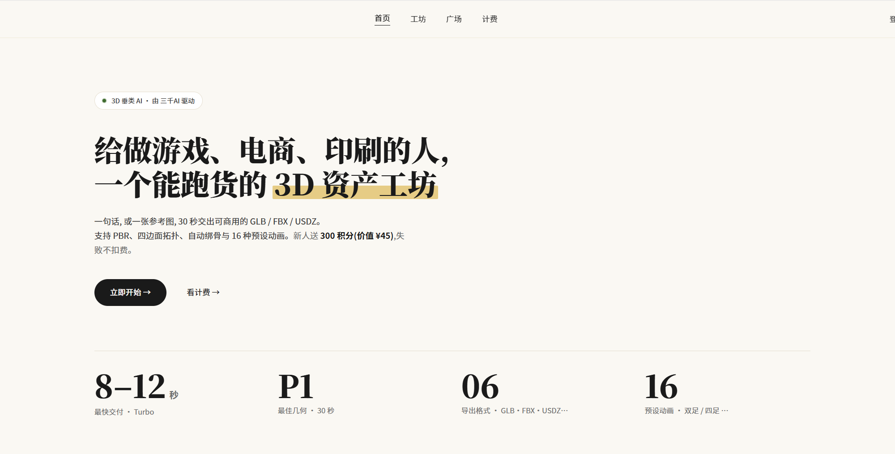

</div>

---

## 一句话介绍

**三千AI · 3D 是一款专为游戏美术、电商代运营、3D 打印 / 手办原型师、影视短视频道具组打造的可商用 AI 3D 资产工坊。一句话 prompt、一张参考图、多视图、或导入已有 GLB / OBJ / FBX —— 30 秒交付带 4K PBR 贴图、四边面拓扑、自动绑骨与 16 种预设动画的资产,导出 GLB / FBX / USDZ / OBJ 全格式。**

做游戏 NPC 资产、做电商 3D 商品上架、做手办原型、做影视虚拟道具 —— **14 项 AI 3D 能力一站式托管**,从生模到绑骨到动画到多格式导出,所有环节在一个站搞完。

---

## ✨ 七大核心能力

### 1️⃣ 四种输入模式 · 文本 / 图像 / 多视图 / 导入

**写一段,上一张,出一件 3D** —— 输入入口完整覆盖创作链路:

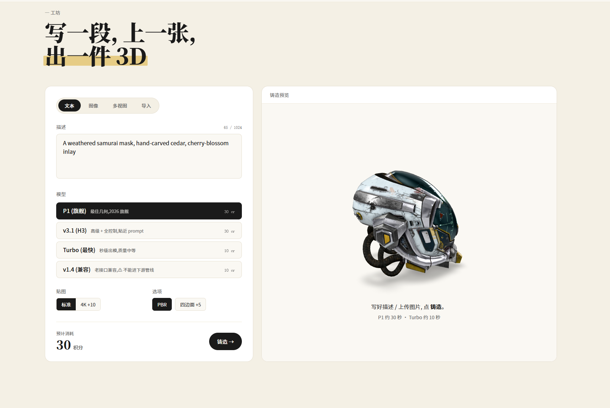

| Tab | 用法 | 适用 |
|---|---|---|
| 📝 **文本** | 一句话 prompt(`A weathered samurai mask, hand-carved cedar, cherry-blossom inlay`) | 从零创作 |
| 🖼️ **图像** | 参考图上传(≤20MB · jpeg / png / webp) | 单图生模 |
| 🎴 **多视图** | 前 / 左 / 后 / 右 4 视图(前视必填,至少 2 张) | 实验功能,**需 P1 模型** |
| 📦 **导入** | 已有 GLB / OBJ / FBX / STL 导入(≤50MB · **免费**) | 利用 4K 重贴图 / 绑骨 / 转格式 / Mesh 编辑现有资产 |

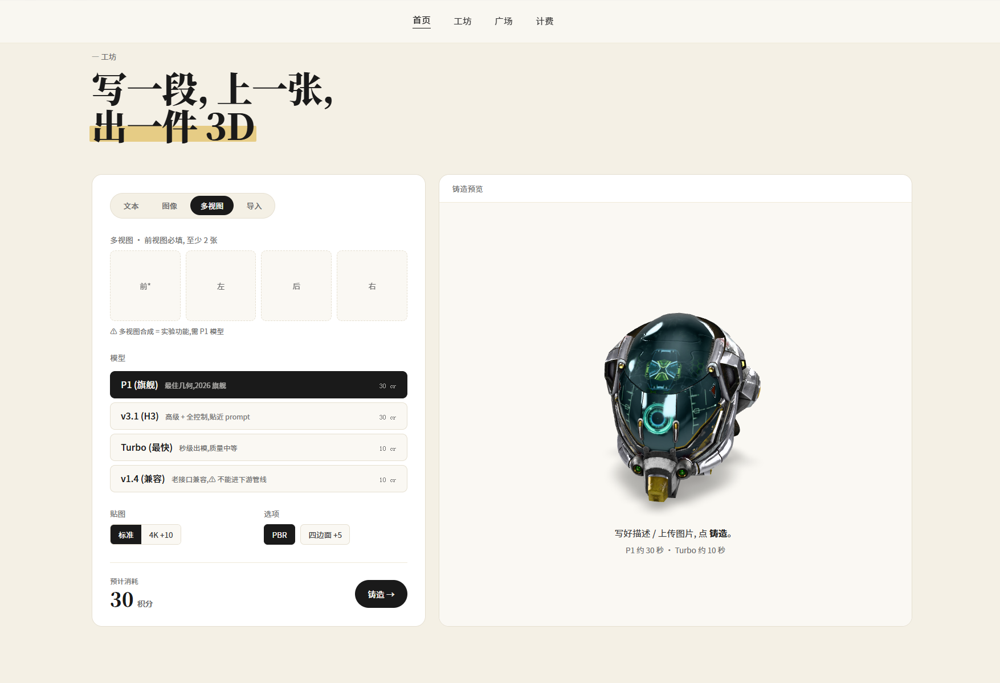

---

### 2️⃣ 四档引擎 · 按需选速度 vs 质量

**不是一刀切的"最强模型",是按场景调度的四档引擎**:

| 引擎 | 时间 | 用途 |
|---|---|---|
| 🏆 **P1(旗舰)** | ~30s | 最佳几何,2026 旗舰,最终交付资产 |
| ⚡ **v3.1(H3)** | ~30s | 高级 + 全控制,贴近 prompt |
| 🚀 **Turbo(最快)** | 8-12s | 秒级出模,质量中等,草模 / 概念验证 / 批量锁方向 |
| 🔁 **v1.4(兼容)** | ~10s | 老接口兼容,**不能进下游管线** |

**推荐工作流**:Turbo 跑 3-5 个种子锁方向 → P1 出最终件。**单 NPC 总成本反而比一上来就 P1 低**。

---

### 3️⃣ PBR + 四边面拓扑 + 绑骨动画(交付级)

**不是裸模,是直接进 Unity / Unreal 的完整资产**:

| 选项 | 输出 | 用途 |
|---|---|---|
| 🎨 **4K 高清贴图** | 标准 / 4K(+10 积分) | 进引擎必备 |
| 🔷 **四边面拓扑(Quad)** | PBR / 四边面(+5 积分) | Maya / Blender / ZBrush 二次雕刻必加 |
| 🦴 **自动绑骨** | 25 积分 · Mixamo 兼容骨架 | 角色 / 生物类必加 |
| 🎬 **16 种预设动画** | 10 积分 / 个 · 双足 8 + 四足 8 | 待机 / 走 / 跑 / 跳 / 攻击 等 |

---

### 4️⃣ 智能网格处理 · 分块 / 补全 / 高低模

| 功能 | 积分 | 适用场景 |
|---|---|---|
| ✂️ **智能分块**(mesh segmentation) | 40 | 3D 打印手办 / 可拆配件 |
| 🧩 **智能补全**(mesh completion) | 50 | 镂空件 / 雕花 / 单视角盲区 |
| 📐 **高模 → 低模(quad)** | 30(+5) | 高模展示 + 低模引擎实时 |

---

### 5️⃣ 多格式导出 + 国内 GLB 加速代理

| 格式 | 适用场景 |
|---|---|
| 🌐 **GLB**(默认) | Web / Unity / Unreal / Three.js / Babylon 通用 |
| 🎮 **FBX** | Maya / 3ds Max / Unreal 标准 |
| 🍎 **USDZ** | Apple AR 生态 |
| 🖨️ **OBJ** | 3D 打印 / 切片软件 |

**格式转换 5 积分** · **国内 GLB 加速代理** 大文件秒级下载,不开梯子,不卡 CDN。

---

### 6️⃣ 失败 0 扣费 · 商用合规

| 机制 | 说明 |
|---|---|
| ❌ **失败 0 扣** | 任何任务失败 —— 引擎报错 / 拓扑失败 / 贴图烘焙失败 —— 系统自动退积分,**无需人工申诉** |
| 📜 **商用授权** | 所有产出模型 + 贴图明确商用授权(游戏 / 电商 / 印刷 / 影视) |
| 🚫 **禁止条款** | 不可用产出做训练集二次训练同类 3D 生成模型 |

---

### 7️⃣ 14 项 AI 3D 能力一站式托管

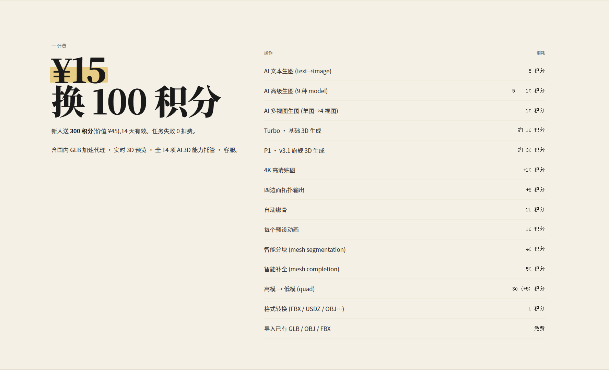

**一个站全部搞完**,不用拼 ZBrush + Substance Painter + Mixamo + Blender 四个工具的链路。

---

## 🎬 8 个范例模型(首页可一键复刻 prompt)

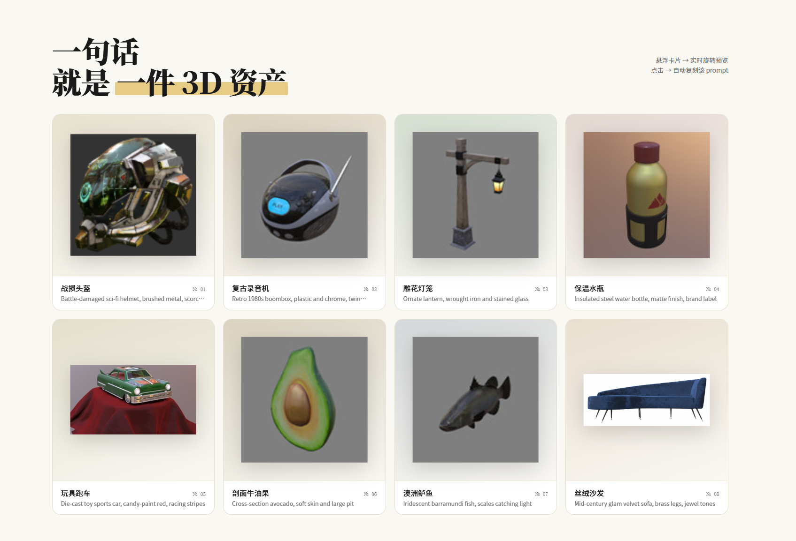

战损头盔(科幻)/ 复古录音机(1980)/ 雕花灯笼(铁艺玻璃)/ 谷仓壁灯(黄铜工业)/ 骨架人偶(T 字形)/ 琥珀蚊子(透明深度)/ 玩具跑车(压铸红)等。

每个模型在演示站可"实时旋转预览 + 一键复刻 prompt"。完整 prompt 库见 [`examples/prompts.md`](./examples/prompts.md)。

---

## 🚀 五步生产线

```
[输入] 文本 prompt / 参考图 / 多视图 / 导入已有 GLB
   ↓
[选引擎] Turbo(草模)→ 锁方向 → P1(最终件)
   ↓
[加交付选项] +4K 贴图 · +Quad 拓扑 · +绑骨 · +16 动画
   ↓
[网格处理] +智能分块 / +智能补全(按需)
   ↓
[导出] GLB / FBX / USDZ / OBJ
```

详细使用流程见 [`docs/quickstart.md`](./docs/quickstart.md)。

---

## 💼 典型场景

### 场景 1 · 游戏 NPC 外包(资产 + 绑骨 + 动画)

8 个 NPC,30 天周期压到 **4 天**:

1. 描述写 prompt:`科幻战士 · 重甲 · 头盔 HUD · 紫色微光 · T 字形姿态`
2. Turbo 跑 3 个种子锁方向
3. P1 引擎出最终件 + 4K PBR + Quad 拓扑
4. 自动绑骨 + 双足 8 动画(待机 / 走 / 跑 / 跳 / 攻击 / 受击 / 死亡 / 胜利)
5. 导出 GLB → 进 Unity Animator 挂载 → 完工

**单 NPC 端到端 8-12 分钟**。

### 场景 2 · 电商 3D 商品上架(80 SKU)

80 个 SKU 一周内铺淘宝 / 抖音 / 京东三平台:

1. 实物图先 rembg 抠白底
2. 工坊选「多视图」,单图生 4 视图(多视角一致性更稳)
3. v3.1 引擎生模 + 4K PBR
4. 导出 GLB → 国内加速代理秒下
5. 上架三平台 3D 商品展位

### 场景 3 · 3D 打印手办原型

文本 / 参考图 → 模型 → 智能分块切件 → STL 导出 → 切片打印 → 组装。

部件越精细打印支撑越少,**手办原型师从 3 周缩到当天出件**。

### 场景 4 · 已有 3D 资产升级 / 修复

**「导入」tab 免费**:导入已有 GLB / OBJ / FBX / STL → 加 4K 贴图 / 自动绑骨 / 格式转换 / Mesh 编辑。

---

## 🎛️ 完善的管理后台

**统计 / 用户 / 功能定价 / 配置一屏掌控,Tripo 真成本 → 积分卖价实时调整**。源码版后台前端 Web 原生适配。

### 统计 · 利润 / 流水

注册用户 / 封禁数 + 30 天充值订单收入 + **30 天毛利**(收入 − Tripo 成本)+ 30 天任务流水(总任务 / 成功 / 收入积分 / Tripo 消耗 cr),**毛利可见**。

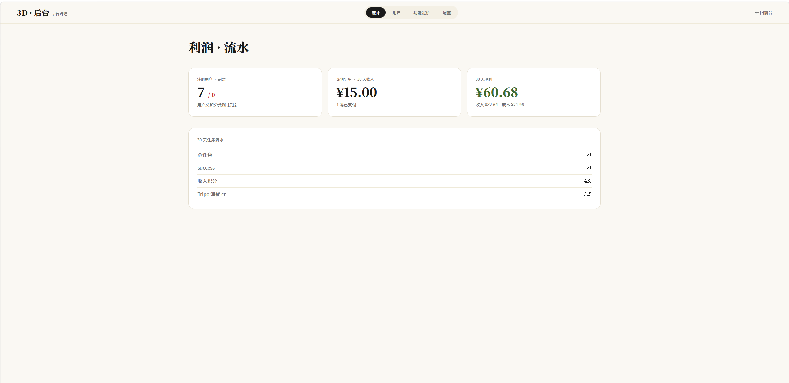

### 用户管理

按手机号搜索 + 创建用户,余额 / 注册时间一表查询,支持 +/- 调积分、改密、封禁。

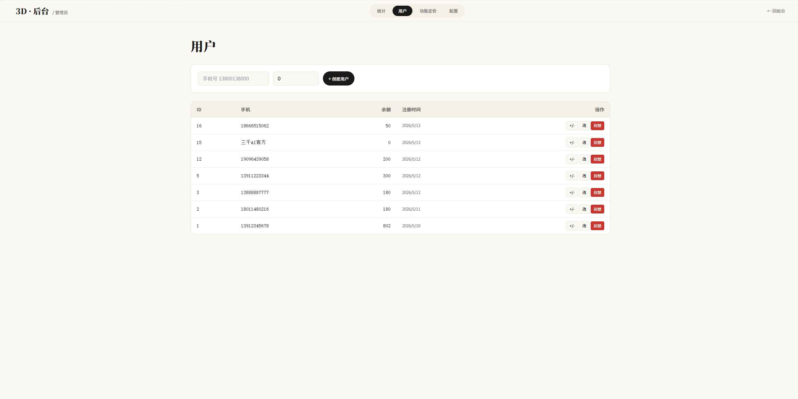

### 功能定价 · Tripo 成本 → 我们卖(积分)实时调

14 项 AI 3D 能力一表配置:**Tripo 成本(cr)** + **我们卖(积分)** + **利润率自动算** + **启用 / 禁用开关**。

涉及能力:PBR 贴图 / 导入已有模型 / AI 文本生图 / 四边面拓扑 / 格式转换 / AI 高级生图 / AI 多视图生图 / Turbo 文本生 3D / 每个预设动画 / 4K 高清贴图 / 自动绑骨 / P1 / v3.1 旗舰 3D / 图像生 3D / 多视图生 3D / 高模 → 低模 / 智能分块。

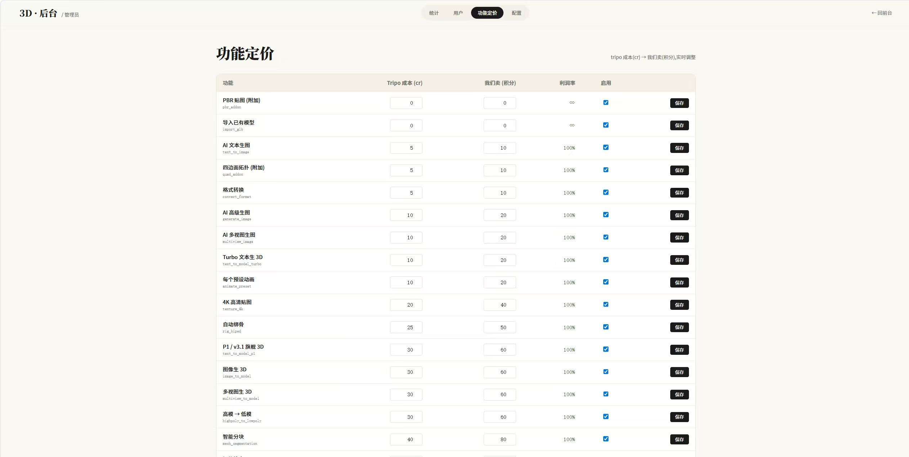

### 配置 · API 密钥 / 阿里云短信 / 易支付

- **Tripo API Key**(`tripo_api_key`)
- **阿里云短信**(AccessKey ID / Secret / 短信签名 / 短信模板 Code)
- **易支付**(网关 / PID / KEY / 回调 URL / 同步跳转 URL)

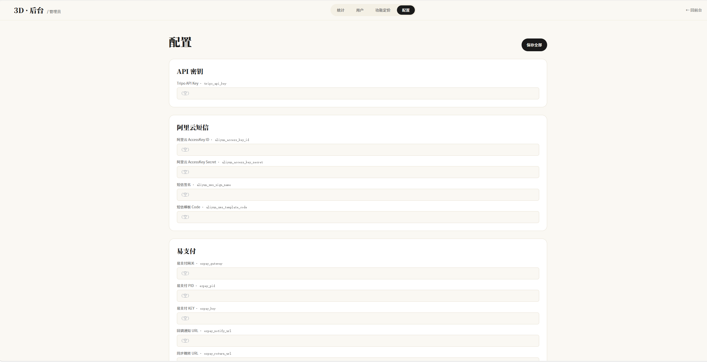

---

## 💼 授权方案

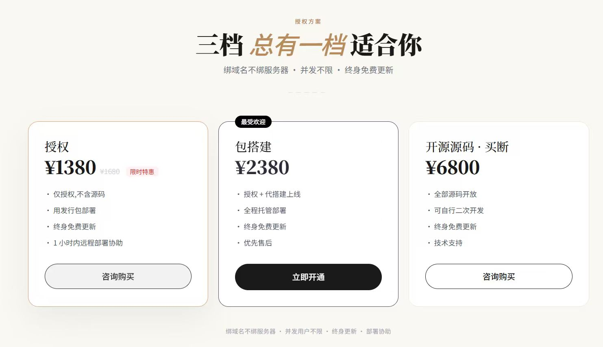

> 想自己跑一套三千AI · 3D SaaS?提供**三档源码授权** —— 绑域名不绑服务器 · 并发不限 · 终身免费更新。

| 档位 | 价格 | 包含 |
|---|---|---|
| **授权** | ~~¥1680~~ **¥1380**(限时特惠) | 仅授权,不含源码 · 用发行包部署 · 终身免费更新 · 1 小时内远程部署协助 |
| 🏆 **包搭建**(最受欢迎) | **¥2380** | 授权 + 代搭建上线 · 全程托管部署 · 终身免费更新 · 优先售后 |
| **开源源码 · 买断** | **¥6800** | 全部源码开放 · 可自行二次开发 · 终身免费更新 · 技术支持 |

**共同权益**:
- ✅ 绑域名不绑服务器(服务器可随时迁移)
- ✅ 并发用户数不限
- ✅ 终身免费更新
- ✅ 部署协助(1 小时内远程上线)

> 💬 具体方案按需求细聊,加商务微信 **aigc5256** 沟通(备注"三千AI · 3D")

> SaaS 演示站(按积分订阅)走 <https://3d.zijie.lol/> · 计费明细见 [`docs/pricing.md`](./docs/pricing.md)

---

## ❓ FAQ

<details>
<summary><b>Q:新人福利具体是什么?</b></summary>

**新人注册即送 300 积分(价值 ¥45),14 天有效**。任务失败 0 扣费,自动退积分。

300 积分可以体验:Turbo 草模 + 几次 P1 旗舰 / 4K 贴图等。
</details>

<details>
<summary><b>Q:产出模型可以商用吗?</b></summary>

可以,所有产出模型 + 贴图明确商用授权,包括游戏内嵌、电商商品、印刷包装、3D 打印商品出售、影视广告等。

**禁止**:用产出做训练集二次训练同类 3D 生成模型。
</details>

<details>
<summary><b>Q:失败任务怎么算?</b></summary>

**失败 0 扣费**,系统自动退还积分,无需人工申诉。
</details>

<details>
<summary><b>Q:能保证质量稳定吗?</b></summary>

同一 prompt 多次出图会有差异,**P1 引擎稳定性最高**。质量不满意可换种子重试。
</details>

<details>
<summary><b>Q:导入已有 GLB / OBJ / FBX 真的免费吗?</b></summary>

**导入本身免费**(≤ 50MB)。导入后做 4K 重贴图 / 自动绑骨 / 转格式 / Mesh 编辑按各自能力扣积分。
</details>

<details>
<summary><b>Q:跟 Hunyuan3D 2.1 自部署比怎么样?</b></summary>

- **几何质量**:两者都强,Hunyuan3D 2.1 是 CVPR 2025 论文实锤
- **拓扑 / 绑骨 / 动画 / PBR**:Hunyuan3D 输出裸模 + 简单贴图,**没有 Quad / 绑骨 / 动画 / PBR 烘焙**,要二次开发 pipeline
- **部署成本**:Hunyuan3D 自部署需 4090 GPU + 一堆环境坑(torch / bpy / realesrgan / pydantic)
- **本平台**:云端 14 项一站式托管,失败 0 扣费

**结论**:大厂研究 / 长期高调用 → Hunyuan3D 自部署;个人接单 / 量产 / 不想运维 → 本平台 SaaS。
</details>

<details>
<summary><b>Q:Mixamo 兼容吗?</b></summary>

绑骨标准与 Mixamo 兼容,可直接用 Mixamo 动画库重定向加自定义动画。

**注意**:重定向前在 Blender 里 `Ctrl+A → Apply All Transforms`,不然 Mixamo 会把模型缩小成蚂蚁。
</details>

<details>
<summary><b>Q:3D 打印用哪个格式?</b></summary>

OBJ(或 STL)。复杂手办建议先 +智能分块,各部件单独打印再组装。
</details>

<details>
<summary><b>Q:v1.4 引擎为什么"不能进下游管线"?</b></summary>

v1.4 是老接口兼容版本,主要用于复刻历史 prompt。如果要进 PBR / Quad / 绑骨 / 动画下游管线,建议用 P1 / v3.1。
</details>

<details>
<summary><b>Q:适合什么样的团队?</b></summary>

- ✅ 独立游戏团队(NPC / 道具批量出货)
- ✅ 电商代运营(3D 商品上架)
- ✅ 3D 打印 / 手办原型师
- ✅ 影视 / 短视频道具组
- ✅ AR / VR 内容快速填充
- ✅ 印刷 / 包装设计快速建模
</details>

---

## 📸 产品截图

### 工坊四种输入模式

| 文本生 3D | 图像生 3D | 多视图生 3D |
|---|---|---|
|  | 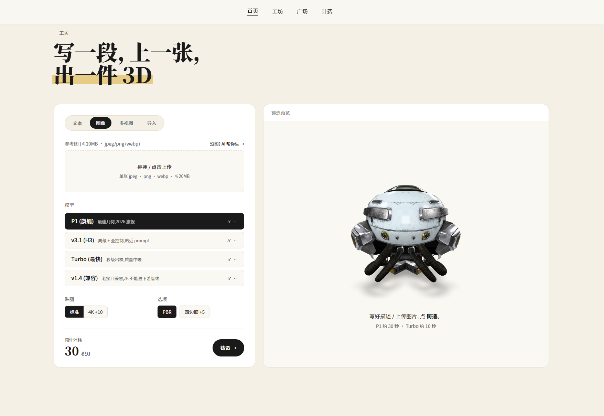 |  |

| 导入已有 3D 文件(免费) | 范例模型墙 | 计费明细 |
|---|---|---|
| 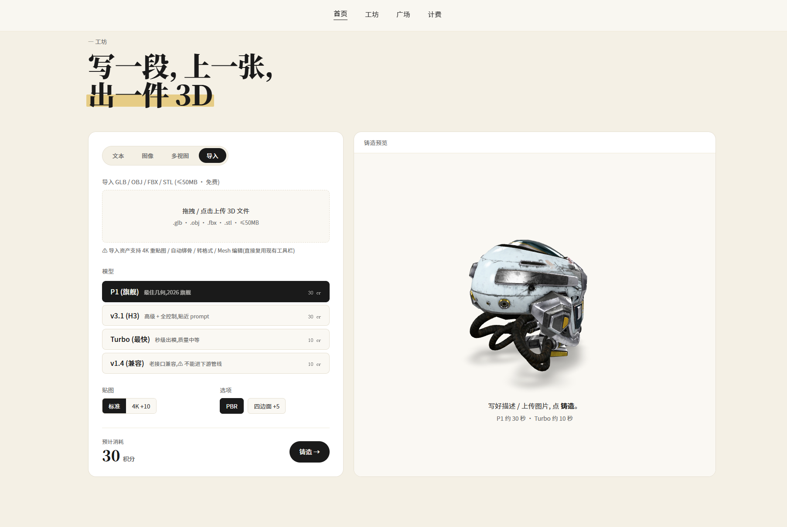 |  |  |

> 完整 8 个首页范例 + 一键复刻 prompt 见演示站 <https://3d.zijie.lol/#showcase>。完整 prompt 库见 [`examples/prompts.md`](./examples/prompts.md)。

---

## 联系方式

- 🌐 **演示站点**:<https://3d.zijie.lol/>
- 💬 **商务微信**:`aigc5256`(添加备注"三千AI"优先回复)
- 🏢 **厂商**:小妍妍网络科技
- 📦 **当前版本**:**v1**(2026-05-31 更新)

**适合人群**:独立游戏团队 · 电商代运营 · 3D 打印 / 手办原型师 · 影视 / 短视频道具组 · AR / VR 内容开发者 · 印刷 / 包装设计

---

## 📄 授权声明

本仓库**仅用于产品文档展示**,存放产品介绍、快速上手、计费机制、FAQ、示例 Prompt 库,**不包含产品源码**。

三千AI · 3D 是云端 SaaS 产品,使用方式见 <https://3d.zijie.lol/>。

- ❌ 禁止冒充产品方提供同名服务
- ❌ 禁止用本仓库内容做虚假宣传
- ❌ 禁止用产出 3D 资产做训练集二次训练同类 3D 生成模型

---

<div align="center">

**如果这个项目对你有启发,请点个 ⭐ Star 支持一下**

© 2026 小妍妍网络科技 · 三千AI · 3D · 保留所有权利

</div>
